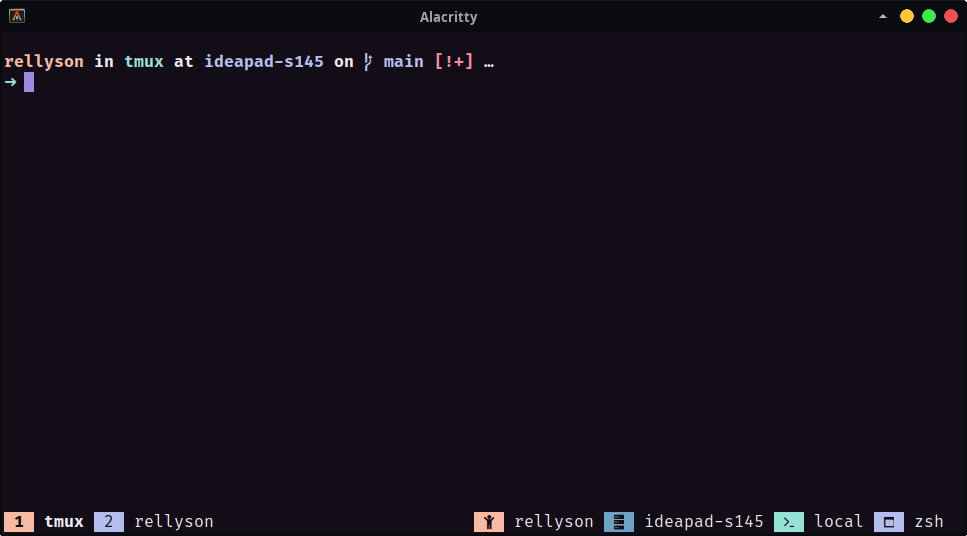

<div align="center">

# Roxo for tmux


[](https://opensource.org/licenses/MIT)



</div>

## Installation

### Using TPM

- Install [TPM](https://github.com/tmux-plugins/tpm)

- Add Roxo to plugins list:

  ```sh
  set -g @plugin 'roxo-theme/tmux'
  # ...alongside
  set -g @plugin 'tmux-plugins/tpm'
  ```
